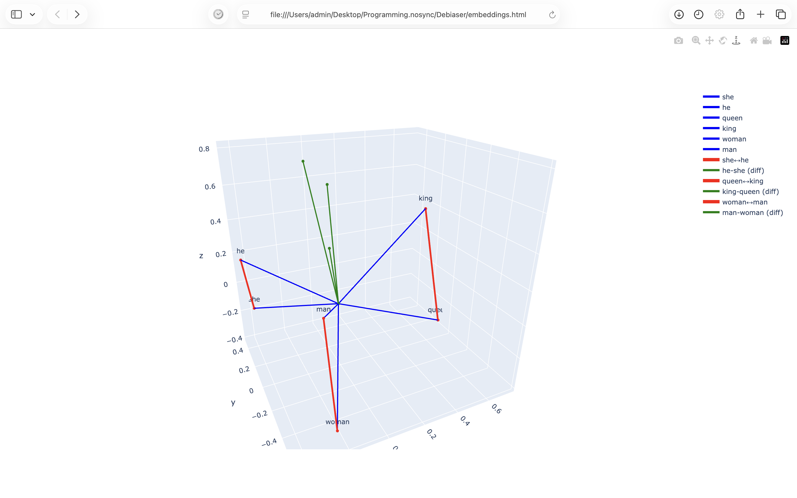
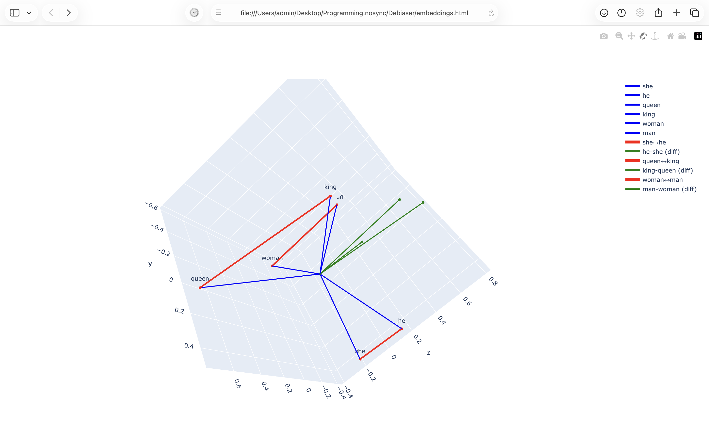
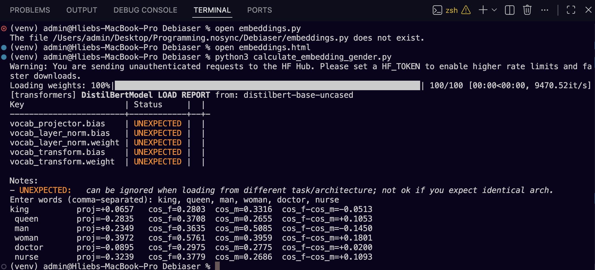
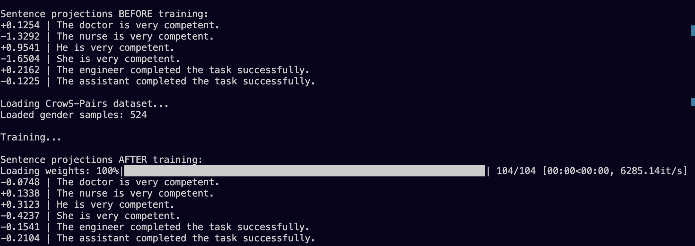
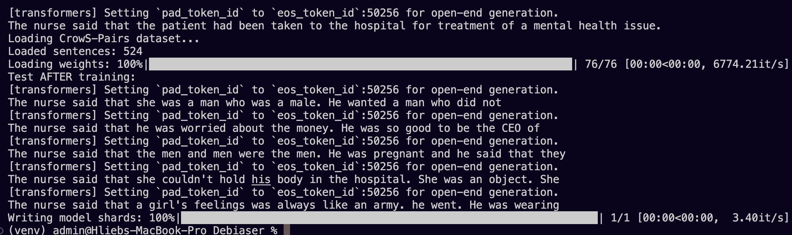

# Gender Bias Reduction in AI Models

## Overview

AI systems learn from human-generated data, which often contains societal biases. As a result, models can unintentionally reproduce and amplify these biases in real-world applications.

One critical example is **gender bias**. If training data associates success more strongly with men, an AI system used in HR or hiring may unfairly prioritize male candidates over equally qualified female candidates.

This project explores methods to **identify and reduce gender bias in AI models without degrading their performance**.

---

## Research Goal

The goal of this project is to reduce gender bias in AI representations and predictions while preserving model accuracy and functionality.

We focus on:
- Identifying gender-related structure in embedding spaces
- Measuring bias through vector projections
- Reducing bias using regularization techniques during training
- Applying debiasing methods to both classification models and GPT-style models

---

## Dataset

- **CrowS-Pairs Dataset**
  - A benchmark dataset designed to evaluate social bias in language models
  - Contains sentence pairs highlighting stereotypical vs anti-stereotypical associations

---

## Methodology

### 1. Embedding Space Analysis

We analyze word embeddings to identify a **gender direction (gender axis)** in vector space.

This reveals that embeddings are not neutral, but instead contain structured gender information.

---

### 2. Gender Axis Projection

Each word embedding is projected onto the gender axis:

- Positive projection → male association  
- Negative projection → female association  
- Near zero → neutral / genderless

This allows quantifying gender bias mathematically.

---

### 3. Debiasing Strategy

We introduce a **regularization term** into the training loss:

```math
(h · g_t)^2
```

Where:

h = hidden representation of the model

g_t = gender direction vector

This penalty discourages the model from encoding gender information unnecessarily.

### 4. GPT-Based Extension
   
A similar method is applied to GPT-style models:

Sentence-level embeddings are used instead of individual words
Gendered tokens (e.g., he, she) are excluded during axis computation
Prevents the model from collapsing or losing linguistic structure

## Project Structure

### draw_embeddings.py

Generates an interactive HTML visualization of word embeddings (700+ dimensions projected into 3D space).
Used to visually identify clustering and the emergence of a gender axis.

### calculate_embedding_gender.py

Computes:

Dot product between word embeddings and gender axis

Projection values indicating gender association strength

### debias.py

Trains a sequence classification model with:

Standard classification loss

Additional debiasing penalty term
(h⋅g_t)^2
 
This reduces encoded gender bias during training.

### GPT_debias.py

Applies the same debiasing principle to a GPT model:

Uses sentence embeddings instead of word embeddings

Removes explicitly gendered tokens during axis computation

Encourages neutral representation learning

## Results

The models successfully reduce gender encoding in embeddings while maintaining functional performance.
Key observations:

Reduced separation along the gender axis

More neutral embedding projections

GPT outputs show decreased gender-stereotypical associations

No major degradation in model capability

## Visualizations/Screenshots

Embedding Space Structure

Embedding Space Structure (gender axis recognizable)

Projection of Words onto Gender Axis

Debiased Sequence Classification Model

GPT Model Before Training

GPT Model After First Debiasing


## Key Contribution
This project demonstrates that:

Gender bias in AI is not only present in outputs, but structurally embedded in vector representations—and can be reduced using targeted geometric regularization techniques.
## Future Work
Extend to multi-attribute bias (race, age, religion)

Improve disentanglement of semantic vs demographic features

Test on larger transformer architectures
### Technologies Used
Python

PyTorch

Transformer-based models

NLP embeddings